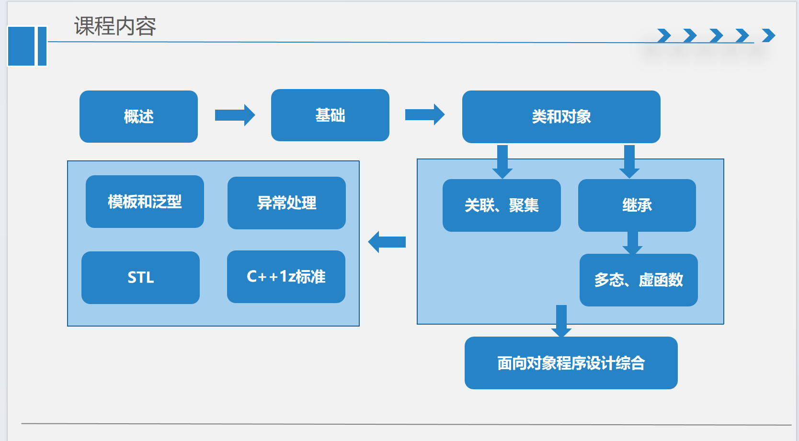
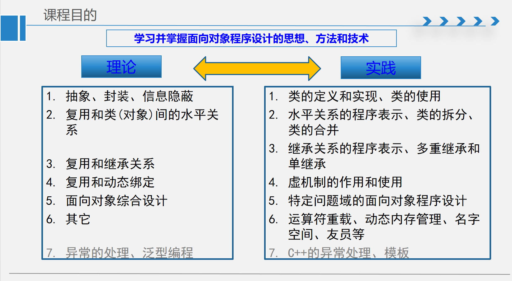
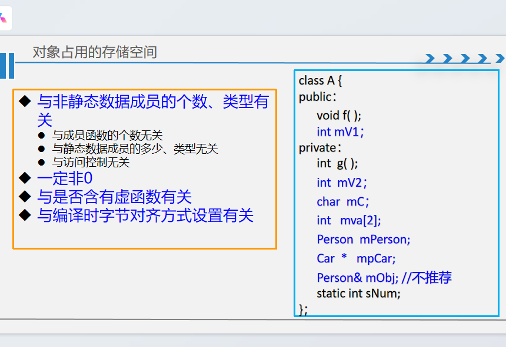
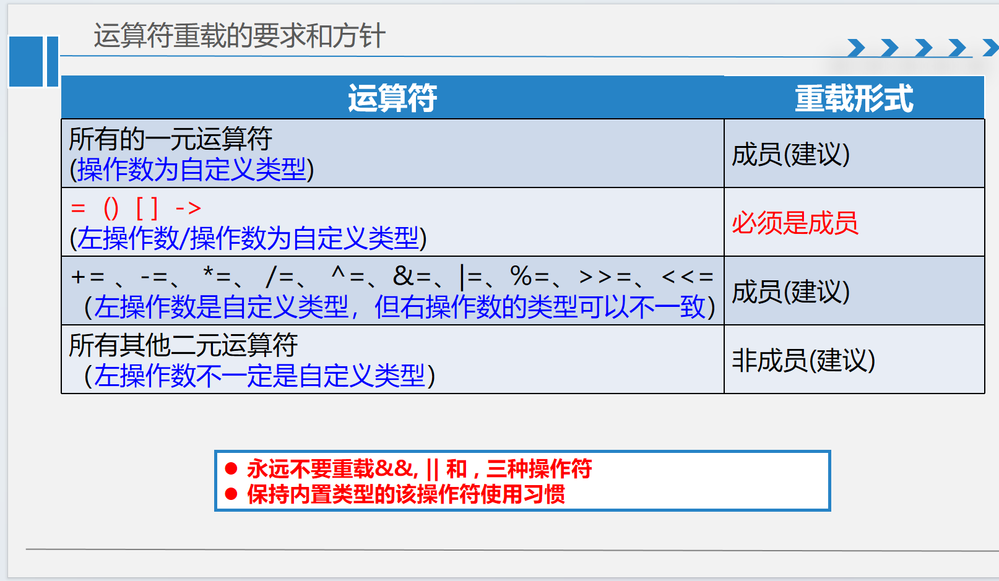
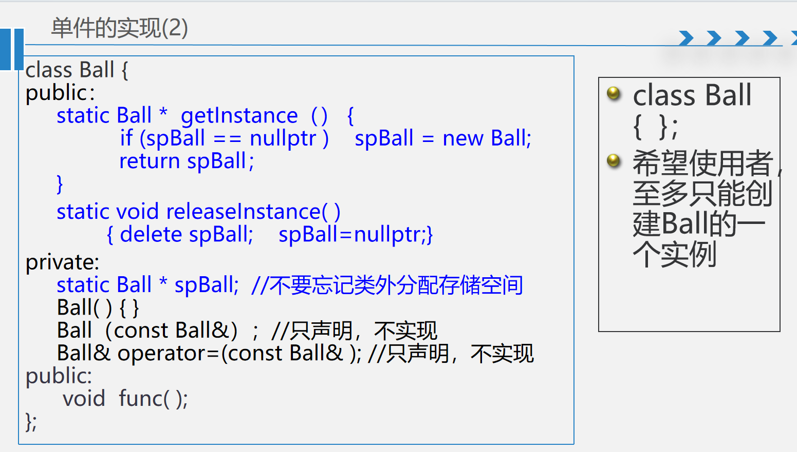
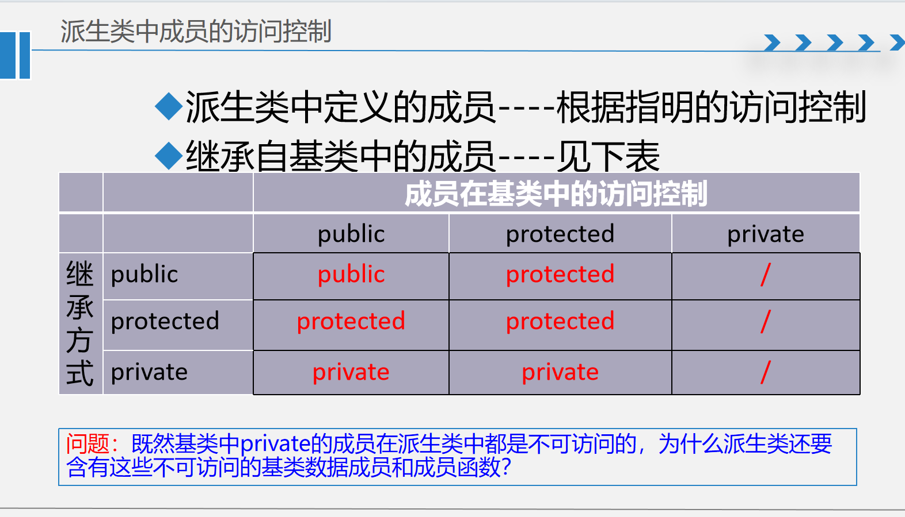

# OOP 学习笔记

## 前言：C++ 学习要点
学好这门课的要点在于真正理解类的之间的关系水平、垂直，它几个基本函数，它真正是怎么工作的，它底层原理是什么。理清楚这几个关系之后，所有的题目都脱离不开这种逻辑关系，就比较好理解。 个人认为课程的前一半的章节都是讲一些细细小小的概念，从细到整体，然后课程的后面对整体之间关系进行了阐明，构成了整个的宏观
- 前置知识是c++的一些基本语法，特别是函数，结构体那块，可以进行类比，笔者在写的时候关于讲基础语法的地方略去
- C 语言中的 malloc 与 c++ 中的 new delete 可以类比


## 第一章： 概述
大概了解一下整体的框架



## 第二章：C++程序结构
### 头文件与编译预处理
#### 工程(项目)组成 &编译过程
-  大致了解框架即可
#### 头文件包含顺序
- `<>` 放在 `""` 前面：`#include <iostream>` 优先于 `#include "myheader.h"`
- 这样做的原因：当发生错误时更容易判断是系统头文件问题还是用户头文件问题

#### 前置声明（Forward Declaration）
- **作用**：告诉编译器一个标识符（类、函数、变量）的类型和含义，但不告知其具体实现位置
- **优点**：减少编译依赖，加快编译速度
- **示例**：
  ```cpp
  class MyClass;  // 前置声明
  void process(MyClass& obj);  // 使用前置声明
  ```

#### 头文件组织原则
- 从各自的 `.c`/`.cpp` 文件出发，将其向外部公开的变量、函数、类等放入对应的头文件
- 头文件应保持最小化接口，隐藏实现细节

#### 包含警戒（Include Guards）
- **传统方式**：`#ifndef`、`#define`、`#endif`
  ```cpp
  #ifndef MYHEADER_H
  #define MYHEADER_H
  // 头文件内容
  #endif
  ```
- **作用**：允许同一个 `.cpp` 文件多次 `#include` 同一个头文件
- **注意**：不能限制不同 `.cpp` 文件都 `#include` 同一个头文件
- **现代方式**：`#pragma once`（非标准但广泛支持）


## 第三章： 类型与变量

### ADT
- 一个ADT：一个数学模型+可施加其上的操作集合。
（类型名称，数据集，数据间的关系，操作集）
- 与具体表示无关
- 与现实世界无关
- 任意性和无穷性

### 类型定义与别名

#### typedef 用法
- **定义类型格式**：`typedef <已知类型> <新类型>`
  ```cpp
  typedef unsigned int uint;
  typedef std::vector<int> IntVector;
  ```
- **定义函数指针类型**：`typedef ReturnType (*新类型)(参数列表);`
  ```cpp
  typedef void (*Callback)(int, const char*);
  ```
- **本质**：`typedef` 本质上没有创建新类型，只是为现有类型创建别名

#### using 别名（C++11）
- **更清晰的语法**：`using 新类型 = 已知类型;`
  ```cpp
  using uint = unsigned int;
  using Callback = void(*)(int, const char*);
  ```

### 枚举类型

#### C++98 枚举
- 只能用列表定义
- 三个特征：
  1. 枚举值隐式转换为整数
  2. 枚举值的作用域与枚举类型相同
  3. 无法指定底层存储类型

#### C++11 强类型枚举（enum class）
- **语法**：`enum class 枚举名 : 底层类型 { 枚举值列表 };`
- **优点**：
  - 强类型，不会隐式转换为整数
  - 枚举值的作用域限定在枚举类型内
  - 可以指定底层存储类型
  - 防止命名冲突

```cpp
enum class Color : unsigned int {
    Red = 0xFF0000,
    Green = 0x00FF00,
    Blue = 0x0000FF
};

enum class Status : char {
    Ok = 'O',
    Error = 'E',
    Pending = 'P'
};

int main() {
    Color c = Color::Red;
    // int value = c;  // 错误：不能隐式转换
    int value = static_cast<int>(c);  // 正确：需要显式转换
    return 0;
}
```

### 类与结构体

#### class 与 struct 的区别
- 在 C++ 中，`class` 和 `struct` 除了默认的访问控制不同之外，完全一致：
  - `class`：默认成员为 `private`
  - `struct`：默认成员为 `public`
- **建议**：
  - 使用 `struct` 表示简单的数据聚合
  - 使用 `class` 表示具有复杂行为的对象

#### 声明与定义
- **声明（Declaration）**：告诉编译器某个标识符的存在和类型
- **定义（Definition）**：为标识符分配存储空间或提供具体实现
- **关系**：所有的定义都是声明，但是声明不一定是定义
- **直观判断**：当需要为某个东西分配空间时，它就是定义

* **注意思考什么时候你头文件写定义，什么时候不写，就比如说常量是不是能在头文件中定义呢?**
#### 使用原则
- **先声明，后使用**：编译器需要知道标识符的类型才能正确编译
- **就近原则**：声明应尽量靠近第一次使用的地方

### 头文件内容规范

#### 可以放在头文件中的内容
1. **声明**：函数声明、类声明、变量声明（extern）
2. **类定义**：因为类定义通常包含包含警戒，所以只会被定义一次
3. **模板定义**：模板必须在头文件中定义
4. **内联函数定义**：`inline` 函数可以在头文件中定义
5. **常量表达式**：`constexpr` 变量

#### 不应放在头文件中的内容
1. **变量定义**（非 extern）：会导致多个编译单元中的重复定义
2. **函数定义**（非内联）：同样会导致重复定义
3. **静态变量定义**：每个包含该头文件的编译单元都会有自己的副本

#### 最佳实践
- 函数定义及变量定义，只能在整个工程中定义一次
- 使用头文件提供接口，源文件提供实现

### 作用域与存储类别

#### 存储空间四区
1. **代码区**：存放程序代码
2. **数据区**：存放全局变量和静态变量
3. **栈区**：存放局部变量和函数参数
4. **堆区**：动态分配的内存

#### 作用域类型

| 作用域类型 | 定义位置 | 可见范围 | 生命周期 |
|-----------|---------|---------|---------|
| **全局作用域** | 所有函数、结构体、类外面，无 static 修饰 | 整个程序所有文件（跨文件可见） | 程序运行期间 |
| **文件作用域** | 函数外，带 static 修饰的全局变量 | 仅限当前 .cpp 文件 | 程序运行期间 |
| **块级作用域** | 被 {} 大括号包裹（函数体、if/for/while、main 函数内部） | 仅当前一对 {} 内部 | 出括号销毁 |
| **类级作用域** | struct / class {} 内部的成员变量/成员函数 | 只能通过对象.成员 / 类::成员访问 | 对象生命周期 |
| **命名空间作用域** | namespace xxx {} 包裹的内容 | 用 xxx:: 限定访问 | 程序运行期间 |

## 第四章 指针、数组、引用、常量 

语法方面不细讲，讲几个注意事项

- ```char * str```  等价于  ```const char * str = "This is a string!";```


 以下列举的必须进行初始化

- 指向变量的常(const)指针:  ```T   *    const  pt = exp;```  

- 指向常量的常(const)指针:   
             ```const  T  *  const pt = exp;```  
             ```const int* pt = &a;```
       ```int const* pt = &a;```
    
判断这些定义的通用的方法就是看const到底是修饰什么的。如果Const修饰的是前面类型，那么就不能通过这个更改值。如果const的修改的是指针，那指针就能指向唯一一个。从那个定义const的不能修改，这个本质来理解


## 第五章 函数
### 函数重载
---
- 函数参数的个数、类型、顺序、const修饰等不完全相同
- 返回值类型不作为区分标志
- 缺省参数(一旦一开始带了，后面都要带)不作为区分标志
- 值类型参数的const型与非const型不作为区分标志
- 引用和指针类型参数，是否可以改变实参，可作为区分标志

转换：若不存在完全匹配的函数，尝试类型转换（每个参数只一次）

- 按值返回
void
内置类型（基本类型，导出类型）：
返回普通内置类型值(非引用，非指针)的 都是const. unsigned int f( ); 等价于  const unsigned int f( ); 因为都是默认变不了的
- 自定义类型
指针：T * f( );   等价于   T * const f( );          但不等价于 const T * f( );
引用：T & f( ); 不等价于 const T & f( );（这时候判断有没有篡改的意图和传出值的生存周期很重要）
### 函数的值传递
- 合不合法的本质还是看上面那章说的const，是不是有篡改的意图？会不会不合法呢？


## 第六章 类和对象

本章大概讲了一个大体框架就不仔细讨论简单的定义

---

对静态数据，C++1z下只允许类内初始化const型且为整型的静态数据成员
 

 
## 第七章： 成员函数

成员函数是定义在类内部的函数，用于操作类的数据成员。C++中的成员函数有多种类型，每种类型都有其特定的用途和语法规则。

### 成员函数类别

C++中的成员函数主要分为以下几类：

1. **一般成员函数**：普通的类成员函数
2. **常成员函数**：使用 `const` 修饰的成员函数，不能修改对象状态
3. **重载的成员函数**：同名但参数不同的成员函数
4. **构造函数和析构函数**：对象的创建和销毁
5. **拷贝构造函数和赋值函数**：对象的复制和赋值
6. **自动转换函数**：类型转换操作符
7. **静态成员函数**：类级别的函数，不依赖于具体对象

### this 指针

- **本质**：`this` 是一个关键字，也是保留字
- **作用**：是非静态成员函数隐含的第一个形参，指向当前对象
- **类型**：相当于 `T * const this`（指向常量的常量指针）
- **使用场景**：在成员函数内部访问当前对象的成员

### 内联实现

- **内部实现**：在类定义内部实现的成员函数自动带有 `inline` 关键字
- **inline 关键字意义**：只有实现同时存在时才有意义
- **建议**：内联函数建议放在头文件中，但过度使用可能导致编译依赖问题（都在自己类里面定义了，那我其他要用到的时候就没法用了）

### 访问控制

C++通过访问控制实现信息隐藏：

- **public**：任何类都可访问
- **private**：仅本类（不是本对象）或友元可以访问
- **protected**：对本类相当于 private，对派生类有特殊访问规则

**C++中封装的实现手段---- class**

**C++中信息隐蔽的实现手段---- 访问控制** 
### 常成员函数

- **语法**：在函数声明后加 `const`，如 `void func() const;`
- 析构函数，构造函数，静态成员函数不可定义为常成员函数，从this 指针的角度来看这个问题
- **this 指针类型**：`const T * const this`
- **限制**：不能修改对象的非静态数据成员
- **非法示例**：
  ```cpp
  int& getID() const { return mID; }      // 错误：返回非常量引用
  int* getIDPtr() const { return &mID; }  // 错误：返回非常量指针，那么我外界就有意图去篡改它
  ```
- **适用场景**：当成员函数不修改对象状态时使用

### 静态成员

#### 静态数据成员（类方法）
- **概念**：类具有的属性或应由类中所有对象共享的属性
- **特点**：
  - 不属于任何对象，属于类本身
  - 在程序开始时初始化，程序结束时销毁
  - 所有对象共享同一份副本

#### 静态成员函数
- **概念**：类属的行为表示
- **特点**：
  - 没有隐含的 `this` 指针
  - 不能使用 `const` 修饰
  - 不能直接访问任何非静态成员（数据成员和函数成员），能用拷贝和构造，因为他们本来就是创建
  - 常用类名限定调用：`ClassName::staticFunction()`
  - 不建议使用对象名调用：`obj.staticFunction()`【误导阅读者，产生语义混淆】

#### 静态与非静态成员函数对比

| 特性 | 普通成员函数 | 静态成员函数 |
|------|------------|-------------|
| **this 指针** | 有隐含的 `this` 指针 | 无 `this` 指针 |
| **调用方式** | 必须通过对象调用 | 可用类名或对象调用 |
| **访问权限** | 可访问所有成员 | 只能访问静态成员 |
| **const 修饰** | 可加 `const` | 不能加 `const` |

## 第八章：构造函数和析构函数

构造函数用于创建对象时进行初始化，析构函数用于对象销毁时清理资源。

#### 构造函数特点
- **名称**：与类名相同
- **返回值**：无返回值
- **explicit 关键字**：可选，用于防止隐式转换
- **类型**：
  - 自定义构造函数
  - 默认构造函数（无参或所有参数有默认值）
  - 拷贝构造函数
  - 移动构造函数（C++11）

#### 初始化列表
某些成员必须在初始化列表中初始化：
- **常量数据成员**（必须）
- **引用数据成员**（必须）
- **对象数据成员**（当没有无参构造函数时，必须）

#### 初始化顺序
1. 先在初始化列表中查找是否指定了初始化方式：
   - 若找到，按指定方式初始化
   - 若没找到，检查定义时是否有初值
   - 否则，按无参构造初始化（内置类型在栈中的值不确定）
2. 若没找到无参构造函数，则报错
3. 全部初始化完成后，再进入构造函数的函数体

#### 析构函数
创建对象----访问构造函数
销毁对象----访问析构函数

- 构造函数的访问
显式调用(显式创建对象)
隐式调用(自动转换)
对象成员的创建
析构函数的访问

程序区、栈区：生存期结束后，自动执行
堆区：需显式调用

## 第九章： 拷贝与赋值

### 拷贝构造函数
- **作用**：从无到有创建一个新对象（从无到有仔细理解）
- **参数**：必须且只需一个本类对象的引用，通常为 `const` 引用
- **特点**：是一种特殊的构造函数

### 缺省拷贝构造函数的问题
> **缺省的拷贝构造函数可能导致的问题：**
> 1. 重复释放堆内存，析构时崩溃（考试最常考）
> 2. 对象共用堆数据，修改互相干扰
> 3. 产生野指针，访问已销毁内存，导致未定义行为

### 禁止拷贝
- **语法**：`ClassName(const ClassName&) = delete;`
- **无参实现**：`ClassName() = default;`

### 赋值函数
- **默认提供**：没有显式给出赋值函数时，由编译器提供
- **访问控制**：`public`
- **实现方式**：采用浅赋值（类似浅拷贝）

### 有引用成员的禁止赋值
- **原因**：引用一旦绑定就不能重新绑定，违背了引用的性质
- **解决方案**：将赋值函数声明为 `delete`

### 浅赋值的不足
1. **目标对象原有堆内存丢失**，导致内存泄漏（独有缺陷）
2. **多对象共享堆**，修改互相干扰
3. **同一块堆重复释放**，析构崩溃
4. **自赋值场景下直接内存泄漏**

### 赋值函数的自我赋值判定
```cpp
B& B::operator=(const B& rhs) {
    if (&rhs != this) {  // 防止自赋值
        delete mpCh;      // 释放原有资源
        mpCh = new char(*rhs.mpCh);  // 深拷贝
    }
    return *this;
}

 B temp(rhs);
 swap(pch,temp.pch);//总是安全的      
 return *this;
```

## 第十章：运算符重载

### 重载限定条件
1. 只能重载一元或二元运算符（不可重载 `?:` 运算符）
2. 操作数至少一个是自定义类型
3. 无法改变运算符的结合律、优先级等固有性质
4. 不可使用新的操作符，如 ⊕、∩ 等

### 重载形式
- **自由函数形式**：`a + b` 编译时转换成 `operator+(a, b)`
- **成员函数形式**：`a + b` 编译时转换成 `a.operator+(b)`

### 成对重载
对于相关运算符，建议成对重载：
- `+` 和 `+=`
- `-` 和 `-=`
- `*` 和 `*=`
- `/` 和 `/=`

#### 前置与后置自增运算符
```cpp
// 前置++
A& A::operator++() {
    // 先自增，后返回
    return *this;
}

// 后置++
A A::operator++(int) {
    A temp = *this;  // 保存原值
    ++(*this);       // 调用前置++
    return temp;     // 返回原值
}
```

## 第十一章： 动态内存管理

### 静态内存的局限性
1. **栈区容量有限**
2. **对象的生存期和作用域不够灵活**
   ```cpp
   MyClass obj(val1, val2);  // 栈上对象
   ```
3. **对象数组的限制**
   ```cpp
   MyClass objs[50];  // 栈上数组
   ```
   - 数组大小必须是编译期常量
   - 数组中的各对象是相同类型、相同大小
   - 通常需要无参构造函数创建各分量对象
   - 增大类间的编译期依赖和耦合度

### 动态内存管理
**new 操作的过程：**
1. 调用 `static void* operator new(std::size_t size)` 函数，尝试分配空间
2. 若失败则转到异常处理函数 `new_handler()`
3. 成功则执行类 `T` 的相应构造函数
4. 将 `void*` 指针转换成 `T*` 指针，并返回

**delete 操作的过程：**
5. 若 `pobj` 为 `nullptr`，则退出
6. 否则执行 `T::~T()` 析构函数
7. 调用 `static void operator delete(void*)`
8. 用户可自定义重载的`operator new` 和`operator delete`一定是静态(static)的,无论是否有`static`关键字若没有显式提供，则使用全局的 `::operator new`和`::operator delete`。


### 动态数组
```cpp
// 动态创建对象数组
MyClass* pArray = new MyClass[10];

// 释放数组
delete[] pArray;  // 注意：使用 delete[] 而不是 delete
```

### 重载 operator new/delete
- **应用场景**：自定义内存管理策略
- **注意**：一般不推荐重载，除非有特殊需求
- **数组动态空间开辟**：使用 `new[]` 和 `delete[]`

### 动态内存管理的优点
1. **灵活性**：对象生命周期可手动控制
2. **容量**：不受栈空间限制
3. **多样性**：可创建不同大小、不同类型的对象集合
4. **减少耦合**：降低编译期依赖

### 注意事项
1. **内存泄漏**：确保每个 `new` 都有对应的 `delete`
2. **双重释放**：避免多次释放同一块内存
3. **野指针**：释放后及时置空指针
4. **数组与单个对象**：`new[]` 对应 `delete[]`，`new` 对应 `delete`


## 第十二章： 命名空间

命名空间（Namespace）是 C++ 中用于组织代码、避免命名冲突的重要机制。它可以将全局作用域划分为不同的命名区域，使得在不同命名空间中可以使用相同的标识符而不会产生冲突。

### 命名空间的定义

```cpp
namespace MyNamespace {
    // 变量声明/定义
    int value = 42;
    
    // 函数声明/定义
    void print() {
        std::cout << "Hello from MyNamespace" << std::endl;
    }
    
    // 类定义
    class MyClass {
    public:
        void show() {
            std::cout << "MyClass in MyNamespace" << std::endl;
        }
    };
}
```

### 命名空间的使用方式

#### 1. 作用域解析运算符（::）
```cpp
MyNamespace::value = 100;
MyNamespace::print();
MyNamespace::MyClass obj;
obj.show();
```

#### 2. using 声明
```cpp
using MyNamespace::value;  // 引入特定标识符
value = 200;  // 可以直接使用
```

#### 3. using 指令
```cpp
using namespace MyNamespace;  // 引入整个命名空间
print();  // 可以直接使用
```

**注意**：`using namespace std;` 在大型项目中应谨慎使用，可能引入命名冲突。

### 嵌套命名空间

```cpp
namespace Outer {
    int outerValue = 1;
    
    namespace Inner {
        int innerValue = 2;
        
        void innerFunc() {
            std::cout << "Inner function" << std::endl;
        }
    }
}

// 使用嵌套命名空间
Outer::Inner::innerFunc();
int val = Outer::Inner::innerValue;
```


### 匿名命名空间

匿名命名空间中的标识符具有内部链接（internal linkage），只能在当前编译单元中使用。

```cpp
namespace {  // 匿名命名空间
    int internalValue = 42;
    
    void internalFunc() {
        std::cout << "Internal function" << std::endl;
    }
}

// 只能在当前文件中使用
internalValue = 100;
internalFunc();
```

### 命名空间别名

```cpp
namespace VeryLongNamespaceName {
    int value = 100;
}

// 创建别名
namespace VLN = VeryLongNamespaceName;

// 使用别名
VLN::value = 200;
```


### 类型转换函数（转化函数）

类型转换函数是特殊的成员函数，用于将类类型转换为其他类型。它们提供了一种定义自定义类型转换的方式。注意没有返回值

#### 1. 转换到内置类型

```cpp
class MyClass {
private:
    int value;
public:
    MyClass(int v) : value(v) {}
    
    // 转换到 int 类型
    operator int() const {
        return value;
    }
    
    // 转换到 double 类型
    operator double() const {
        return static_cast<double>(value);
    }
    
    // 转换到 bool 类型
    explicit operator bool() const {
        return value != 0;
    }
};

int main() {
    MyClass obj(42);
    
    // 隐式转换到 int
    int x = obj;  // 调用 operator int()
    
    // 隐式转换到 double
    double y = obj;  // 调用 operator double()
    
    // 显式转换到 bool（explicit 关键字）
    if (static_cast<bool>(obj)) {
        std::cout << "obj is non-zero" << std::endl;
    }
    
    return 0;
}
```


#### 4. 转换函数的特点和注意事项

1. **没有返回类型**：转换函数没有返回类型声明
2. **没有参数**：转换函数没有参数
3. **必须是成员函数**：转换函数必须是类的成员函数
4. **不能是静态函数**：转换函数不能是静态成员函数
5. **const 修饰**：通常应该声明为 const 成员函数
6. **避免歧义**：过多的转换函数可能导致隐式转换歧义

```cpp
class AmbiguousClass {
public:
    operator int() const { return 1; }
    operator double() const { return 1.0; }
};

void func(int) {}
void func(double) {}

int main() {
    AmbiguousClass obj;
    // func(obj);  // 错误：歧义，不知道调用哪个 func
    func(static_cast<int>(obj));  // OK: 显式指定类型
    
    return 0;
}
```
## 第十三章 类间关系

  
 
- 当前场景的兼容性 代码中仅将 B 作为成员函数的返回值类型出现在函数声明 B func(); 中。

- C++ 语法规则明确：函数声明里的返回值类型、参数类型，只需要是 “已声明的类型” 即可，编译器不需要计算类型大小、也不需要访问类成员，因此前置声明完全够用。

- 必须包含 B.h 的场景：只有当代码需要获取类 B 的完整信息时，才必须引入 B.h 头文件，典型情况包括：定义了B，调用了函数 ，指针好像不用

---

- 强关联：A.h 需要 B.h 才能编译成功
- 硬关联： 类A和类B之间存在双向关系，并且两者之间有强关联
- 弱关联： A.cpp 必须包含B.h才能编译通过
- 软关联：只使用了B的指针代替对象作为数据成员
- 物理关系：编译依赖性


### 逻辑关系：水平和竖直

    水平     
            依赖关系： 偶然知道

	        关联关系（数据成员形式）：黑盒复用

 			1. 一般关联  含义：在B类对象的生存期，“一直知道” A类对象 可单向，可双向可一对一，可一对多，多对一自关联

 			2. 自关联
			3. 关联类

			4.聚集关联
			聚合/组合关系:特殊的关联。通常表示整体与部分的关系。
			聚合关系:   B “has-a” A, 但B类不负责A类对象的生存与消亡。 B *mp
			组合关系： B “contain-a” A, B类负责A类对象的生存与消亡。 B mp
## 第十四章：类的设计
这章内容等于把前面的合起来总和讲一讲没什么新的，注意的是这里有个**单例**比较重要
```cpp
class Ball { 
	public：      
		static Ball &  getInstance（） 
		{static Ball aBall；return aBall}
private: 
     //私有化构造函数，防止外部访问，
     //或者 编译器提供缺省的构造函数
     Ball( ) =default;
     //同理
     Ball（const Ball&）= delete;
     Ball& operator=(const Ball& )=delete; 
```



## 第十五章：继承
---
 

垂直关系：继承：白盒复用 复用完整的既有代码进行拓展

**默认为private继承(无明确指定的继承方式时)**

- 派生类的成员：

   派生类的构造、析构、拷贝、赋值函数

   派生类中定义的成员函数、数据成员

   **基类中的的所有成员 （除基类的构造、析构、拷贝、赋值函数、自动转换函数（我个人理解为一些特征函数）)**


### 会考程序阅读题
    比如给你一串代码ABCD类，有一个长的继承树，让你判读段整个的构造和析构顺序

### 构造顺序

- 派生类是通过继承关系复用基类的代码和实现来定义的
派生类的构造函数：

    构造顺序：先基类，再派生类

    初始化列表中可以指定基类的构造函数或拷贝构造函数

    多重继承时，基类按先后顺序构造

    **派生类的析构函数：
    先执行派生类的析构，再自动执行基类析构**


### 几个关键字

- `overload` 重载：在同一个范围内

- `newdefine` 派生类中新增加的函数，基类没有

- `redefine` 重定义，与基类同名字，参数列表相同，尽量不要重定义

- `override` 都带`virtual`关键字，重写复写 

- `overwrite` 覆盖（名字一样），隐藏了。要用可以用`using` 重新使用


### 最佳实践：

- 1.不重定义

  2.重写列表一致 

  3.慎重重载


### 访问控制



### 继承之间的关系
``` 
public继承：      is a    like a 
private继承：     has a  子类有基类 完全可换成组合。
保护继承和私有继承都表示派生类与基类之间存在 "has-a"、"contain-a" 或 "implement-of" 的
关系。两者的区别在于这种关系的传递性：在私有继承中，这种关系仅限于直接的派生类与基类之间，不会传递给更远的派生类。而在保护继承中，这种关系可以沿着继承树传递给所有间接派生类，而不仅仅局限于直接派生类。
```


**组合优先**

## 第十六章： 继承和类型转换
---

- `protected/private`继承下的向上类型转换
无实际意义可通过强制类型转换或自动转换函数进行转换
继承下 

- `private/protected`继承下无实际意义(行为集不相关，数据也不全)
若确实需要，可在`Derived`中定义构造函数-- `Derived::Deived(const Base& );`


- `public` 继承方式此时的向上类型转换有意义
  逻辑上，是类型的泛化或一般化  
 语言上，`public`行为集被窄化


- `public`继承方式下向下类型转换 
    此时的向下类型转换有意义    
    但可能成功，也可能失败
    只能在运行时确定`(dynamic_cast）`


### 转换方式
内置类型的自动转换，如 `int->float` 
构造函数转换
定义自动转换函数
`public`继承下的向上类型自动转换
使用类型转换操作符
`static_cast`  相当于**强制类型转换**，不能是对象

`const_case` 用于添加或移除表达式中的`const`或`volatile`约束(volatile 是 C/C++ 中的类型修饰符，核心作用是告知编译器：被修饰的变量可能会被程序流之外的未知因素修改，禁止编译器对该变量的读写做优化，强制每次访问都直接操作内存)

`reinterpret_cast`转换操作符  对表达式的类型做出重新解释，常用于重新解释函数

 `dynamic_cast<T>(exp)`动态转换：
在运行时刻，尝试将exp转换成T类型。多用于public继承下，将父类类型转换成子类类型；
T**只能为类的指针、类的引用、void** *三种形式;
dynamic_cast**要用到RTTI(运行时类型识别),通常各编译器都是通过虚拟表(VTable)来实现RTTI的，因此类中要有虚函数，才能使用.**

## 第十七章 多重继承
---
多重继承下的命名冲突本质上是数据成员的命名冲突，（钻石结构）

### 虚基类（virtual关键字的继承）
虚基类的延迟构造（原理）

### 解决钻石结构的方法
单继承

接口继承：工具类（类变量类方法），接口类（虚函数）

在混入继承时，允许有多个父类，这些父类既可以是接口类，也可以是非接口类，然
而，在所有非接口类的父类中，最多只允许一个父类有祖先类，其他非接口类必须是顶层类。这样可以避免类似钻石结构中的命名冲突问题，因为只有一层会到上面

## 第十八章 虚机制
---
### 静态编联与动态编联

静态编联，编译期间就确定函数调用版本。

动态编联 C++这样需要静态编译的语言，最常见的实现方式是通过

虚机制。C++中的虚机制包括虚函数、虚函数表、对象的内存布局、类型信息的存储


### 规范

- **构造和拷贝构造不能为虚函数 	如果类中有其他虚函数，析构函数也应该定义为虚函数**

- 通常采用`public`继承方式

    继承自基类的虚函数（除虚的析构函数）

    若基类的析构函数是虚的，那么派生类中的析构函数也是虚的

    派生类中新的虚函数

    派生类`override`基类中的虚函数（也称复写、重写）

    函数名字同基类中虚函数的名字

    `virtual`关键字可省略

    返回类型必须与基类中虚函数的返回类型相同或相容  

    可能会隐藏基类中重载的虚函数`(overwrite,hide)`

### 虚拟表虚拟表指针
虚函数表也称虚拟函数表、虚拟表、虚表，它是**一个指针数组，其中存放类中各虚函数的入口
地址。因为类的构造的时候没有加载虚函数的地址**

vptr虚拟表指针，用于指向虚拟表

### 编联
```静态类型：在编译期间，可以确定的变量类型 
指针型：Parent  * pObj = &child;
引用型：Parent& obj = child；
对象型：Parent    obj = child； 
 //对象型中obj的静态、动态一致
动态类型：在运行时，才可以确定的、对应于变量的真实类型
```
### 特别的类
```
具体类：可以实例化
抽象类：为子类提供更高层次的抽象，本身不能被实例化，但后裔类可以实例化.
```
抽象类的定义
**含有一个或多个纯虚函数。**

纯虚函数格式 (一定是成员函数) ：
     `virtual  ReturnType func(…. ) [const] = 0;`

纯虚函数的访问控制可任意
具体类的子类可以是具体类或抽象类

抽象类的子类可以是具体类或抽象类

纯抽象类：除静态、构造、拷贝构造、析构（是虚）、赋值等函数之外均为纯虚函数.

(**赋值函数永远不要定义为virtual的, 析构必为虚的，但不能是纯虚**)

纯虚定义:对纯虚函数给出实现

C++中的接口类：是纯抽象类，通常均为public成员，且没有任何非静态的数据成员

### 最佳实践
- 虚/非虚函数的选择

    使用override关键字

    不要重定义父类的非虚函数 

    不要定义私有的虚函数

    显式定义虚的析构函数 

    不要重载虚函数

    不要定义虚的赋值函数

    使用抽象类和接口类 


## 多态

多态（Polymorphism）是面向对象编程的三大特性之一（封装、继承、多态），它允许使用统一的接口处理不同类型的对象。C++ 支持两种主要的多态形式：静态多态和动态多态。

### 静态多态

静态多态在编译期间确定，主要通过以下两种方式实现：

#### 1. 函数重载（Function Overloading）
- **概念**：在同一作用域内，多个函数使用相同的名称但具有不同的参数列表
- **特点**：
  - 编译时确定调用哪个函数
  - 根据参数的类型、数量或顺序进行区分
  - 返回类型不同不能作为重载依据

```cpp
class Calculator {
public:
    // 重载的 add 函数
    int add(int a, int b) {
        return a + b;
    }
    
    double add(double a, double b) {
        return a + b;
    }
    
    int add(int a, int b, int c) {
        return a + b + c;
    }
};
```

#### 2. 模板（Templates）
- **概念**：通过参数化类型实现代码复用
- **特点**：
  - 编译时实例化
  - 类型安全
  - 支持泛型编程

```cpp
// 函数模板
template<typename T>
T max(T a, T b) {
    return (a > b) ? a : b;
}

// 类模板
template<typename T>
class Stack {
private:
    T* data;
    int top;
public:
    Stack(int size) : data(new T[size]), top(-1) {}
    void push(T value) { data[++top] = value; }
    T pop() { return data[top--]; }
};
```

### 动态多态

动态多态在运行时确定，主要通过虚函数机制实现。

#### 虚函数机制
- **核心原理**：根据目标对象的动态类型和参数表中参数的静态类型确定目标代码体
- **实现方式**：虚函数表（vtable）和虚函数指针（vptr）

```cpp
class Shape {
public:
    virtual double area() const = 0;  // 纯虚函数
    virtual void draw() const {
        std::cout << "Drawing a shape" << std::endl;
    }
    virtual ~Shape() {}  // 虚析构函数
};

class Circle : public Shape {
private:
    double radius;
public:
    Circle(double r) : radius(r) {}
    
    double area() const override {
        return 3.14159 * radius * radius;
    }
    
    void draw() const override {
        std::cout << "Drawing a circle with radius " << radius << std::endl;
    }
};

class Rectangle : public Shape {
private:
    double width, height;
public:
    Rectangle(double w, double h) : width(w), height(h) {}
    
    double area() const override {
        return width * height;
    }
    
    void draw() const override {
        std::cout << "Drawing a rectangle " << width << "x" << height << std::endl;
    }
};

int main() {
    Shape* shapes[3];
    shapes[0] = new Circle(5.0);
    shapes[1] = new Rectangle(4.0, 6.0);
    shapes[2] = new Circle(3.0);
    
    // 动态多态：根据实际对象类型调用相应函数
    for (int i = 0; i < 3; i++) {
        shapes[i]->draw();
        std::cout << "Area: " << shapes[i]->area() << std::endl;
        delete shapes[i];
    }
    
    return 0;
}
```

#### 动态多态的特点
1. **运行时绑定**：函数调用在运行时根据对象的实际类型确定
2. **通过基类指针或引用调用**：实现统一接口处理不同派生类对象
3. **需要虚函数支持**：基类中声明虚函数，派生类中重写（override）
4. **性能开销**：虚函数调用比普通函数调用稍慢（需要查虚函数表）

#### C++ 不支持的多态形式
C++ **不支持**根据目标对象的动态类型和参数表中参数的动态类型确定目标代码体。这意味着：
- 函数重载解析基于参数的静态类型
- 虚函数调用基于对象的动态类型，但参数匹配基于静态类型

```cpp
class Base {
public:
    virtual void process(int x) {
        std::cout << "Base::process(int)" << std::endl;
    }
};

class Derived : public Base {
public:
    void process(int x) override {
        std::cout << "Derived::process(int)" << std::endl;
    }
    
    void process(double x) {
        std::cout << "Derived::process(double)" << std::endl;
    }
};

int main() {
    Base* ptr = new Derived();
    ptr->process(10);      // 调用 Derived::process(int)
    ptr->process(10.5);    // 调用 Base::process(int) - 参数 10.5 转换为 int
    // 不会调用 Derived::process(double)，因为参数匹配基于静态类型 Base*
    
    delete ptr;
    return 0;
}
```

### 多态的应用场景

1. **框架设计**：定义通用接口，允许用户扩展功能
2. **插件系统**：通过基类接口加载不同的插件实现
3. **回调机制**：使用虚函数实现回调
4. **设计模式**：工厂模式、策略模式、观察者模式等

### 最佳实践

1. **基类析构函数声明为虚函数**：确保正确释放派生类资源
2. **谨慎使用多重继承**：避免菱形继承问题
3. **优先使用组合而非继承**：降低耦合度
4. **明确使用 override 关键字**：提高代码可读性和安全性
5. **避免过度使用虚函数**：在性能敏感的场景中考虑替代方案

### 总结

多态是 C++ 面向对象编程的核心特性之一：
- **静态多态**：编译时确定，通过函数重载和模板实现，性能高但灵活性有限
- **动态多态**：运行时确定，通过虚函数机制实现，灵活性高但有性能开销
- **适用场景**：根据具体需求选择合适的多态形式，平衡性能与灵活性
